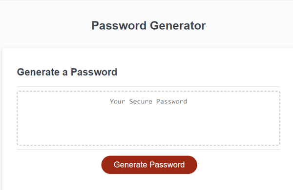
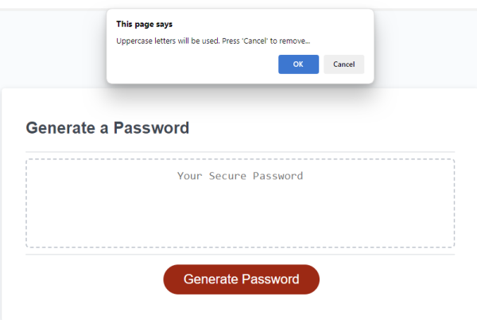
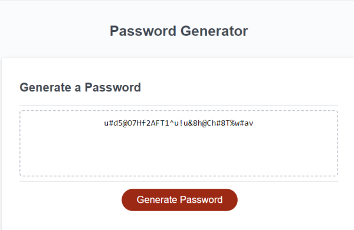

# Random Password Generator

This project is based on generating a random password based on the criteria set forth / prompted by the user. 

## Table of Contents

- [About](#about)
- [Getting Started](#getting_started)
- [Installing](#installing)
- [Usage](#usage)
- [Screenshots](#screenshots)
- [Contributing](#contributing)

## About

 - This javascript app/function will create a random password from 8 to 128 characters involving uppercase and lowercase letters, special characters, and numeric values. All or one but none will not work.

## Getting Started

Just click the "Generate Password" button and follow the directions/prompts.

## Installing

No installation necessary.

## Usage

This can be used to develop your own custom random password up to 128 characters.

## Screenshots

## Contributing

Clinton Scheible
- UTSA Bootcamp
- Challenge 1
